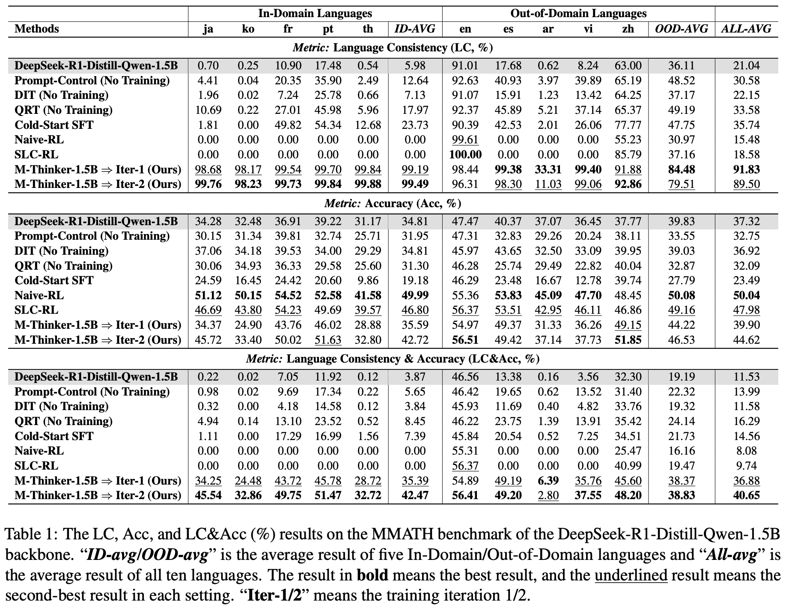
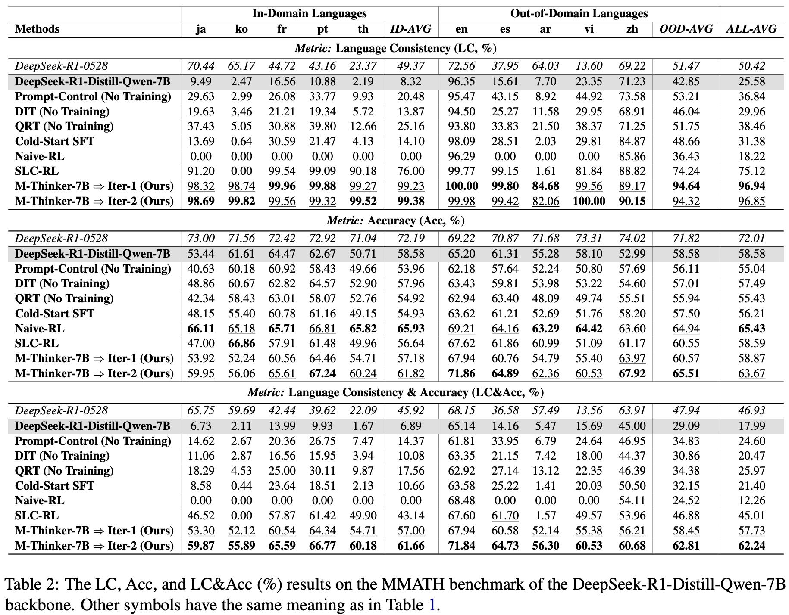
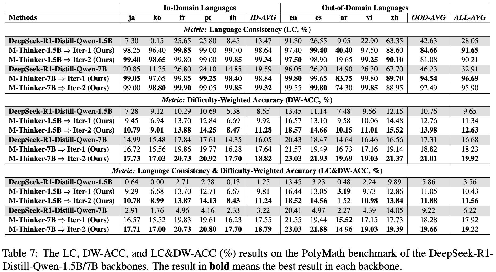

# M-Thinker

#### **Paper:** [Think Natively: Unlocking Multilingual Reasoning with Consistency-Enhanced Reinforcement Learning](https://arxiv.org/pdf/2510.07300)


| Model Access | Backbone | Training data Access | 
| :-- | :-- | :-- |
 <a href="https://huggingface.co/XueZhang-bjtu/M-Thinker-7B-Iter2">M-Thinker-7B-Iter2</a> (👍👍) |   <a href="https://huggingface.co/XueZhang-bjtu/M-Thinker-7B-Iter1">M-Thinker-7B-Iter1</a> |    [M-Thinker-7B-RL-Iter2-data](https://huggingface.co/datasets/XueZhang-bjtu/M-Thinker-7B-RL-Iter2-data) 
 <a href="https://huggingface.co/XueZhang-bjtu/M-Thinker-7B-Iter1">M-Thinker-7B-Iter1</a> (👍) |    [7B-cold-start-SFT](https://huggingface.co/XueZhang-bjtu/7B-cold-start-SFT) |    [M-Thinker-7B-RL-Iter1-data](https://huggingface.co/datasets/XueZhang-bjtu/M-Thinker-7B-RL-Iter1-data) 
  [7B-cold-start-SFT](https://huggingface.co/XueZhang-bjtu/7B-cold-start-SFT) |  [DeepSeek-R1-Distill-Qwen-7B](https://huggingface.co/deepseek-ai/DeepSeek-R1-Distill-Qwen-7B) |  [M-Thinker-SFT-data](https://huggingface.co/datasets/XueZhang-bjtu/M-Thinker-SFT-data)
 <a href="https://huggingface.co/XueZhang-bjtu/M-Thinker-1.5B-Iter2">M-Thinker-1.5B-Iter2</a> (👍👍) |   <a href="https://huggingface.co/XueZhang-bjtu/M-Thinker-1.5B-Iter1">M-Thinker-1.5B-Iter1</a> |    [M-Thinker-1.5B-RL-Iter2-data](https://huggingface.co/datasets/XueZhang-bjtu/M-Thinker-1.5B-RL-Iter2-data) 
 <a href="https://huggingface.co/XueZhang-bjtu/M-Thinker-1.5B-Iter1">M-Thinker-1.5B-Iter1</a> (👍) |    [1.5B-cold-start-SFT](https://huggingface.co/XueZhang-bjtu/1.5B-cold-start-SFT) |    [M-Thinker-1.5B-RL-Iter1-data](https://huggingface.co/datasets/XueZhang-bjtu/M-Thinker-1.5B-RL-Iter1-data) 
  [1.5B-cold-start-SFT](https://huggingface.co/XueZhang-bjtu/1.5B-cold-start-SFT) |  [DeepSeek-R1-Distill-Qwen-1.5B](https://huggingface.co/deepseek-ai/DeepSeek-R1-Distill-Qwen-1.5B) |  [M-Thinker-SFT-data](https://huggingface.co/datasets/XueZhang-bjtu/M-Thinker-SFT-data)


---

Large Reasoning Models (LRMs) have achieved remarkable performance on complex reasoning tasks by adopting the "think-then-answer" paradigm, which enhances both accuracy and interpretability. However, current LRMs exhibit two critical limitations when processing non-English languages: (1) They often struggle to maintain input-output language consistency; (2) They generally perform poorly with wrong reasoning paths and lower answer accuracy compared to English. These limitations significantly degrade the user experience for non-English speakers and hinder the global deployment of LRMs. To address these limitations, we propose M-Thinker, which is trained by the GRPO algorithm that involves a **Language Consistency (LC) reward** and a novel **Cross-lingual Thinking Alignment (CTA) reward**. Specifically, the LC reward defines a strict constraint on the language consistency between the input, thought, and answer. Besides, the CTA reward compares the model's non-English reasoning paths with its English reasoning path to transfer its own reasoning capability from English to non-English languages. Through an iterative RL procedure, our M-Thinker-1.5B/7B models not only achieve nearly 100% language consistency and superior performance on two multilingual benchmarks (MMATH and PolyMath), but also exhibit excellent generalization on out-of-domain languages.

<p align="center">
    <br>
    
    <br>
</p>

<p align="center">
    <br>
    
    <br>
</p>

<p align="center">
    <br>
    
    <br>
</p>

---


### Environments

`environment-lf_train.yml`: Only for Cold-Start SFT. We provide our used LLaMA-Factory (`LLaMA-Factory.tar.gz`).

`environment-verl.yml`: For RL training and evaluation. You need to install our modified verl framework (`verl.tar.gz`) to run our scripts.


### Step 1: Cold-Start SFT

You can download the training data for cold-start SFT from  [M-Thinker-SFT-data](https://huggingface.co/datasets/XueZhang-bjtu/M-Thinker-SFT-data).

```
bash scripts-train/SFT-lf-1.5B.sh

bash scripts-train/SFT-lf-7B.sh
```

We released our cold-started models on  [1.5B-cold-start-SFT](https://huggingface.co/XueZhang-bjtu/1.5B-cold-start-SFT) and   [7B-cold-start-SFT](https://huggingface.co/XueZhang-bjtu/7B-cold-start-SFT).

### Step 2: Rejection sampling to select RL training data for Iter1

We released the training data for Iter1 on  [M-Thinker-1.5B-RL-Iter1-data](https://huggingface.co/datasets/XueZhang-bjtu/M-Thinker-1.5B-RL-Iter1-data) or   [M-Thinker-7B-RL-Iter1-data](https://huggingface.co/datasets/XueZhang-bjtu/M-Thinker-7B-RL-Iter1-data).

If you want to conduct our training procedure on other models, you need to reconstruct the training data based on your own cold-started model. For example:

```
# Split the translated Light-R1-SFT (76K) data into training data for cold-start SFT and the rest of the data
python code/split_train_data_for_stage1.py

# Generate responses using the cold-started model for ID-languages (rollout = 8)
bash scripts-data/predict_answer-stage1.sh

# Filter data according to 0 < number(format correct & language consistency & accuracy) < 8 to construct RL training data
python code/filter_RL_data-fix-stage1.py

# Generate English responses using the cold-started model for the Cross-lingual Thinking Alignment Reward
bash scripts-data/self_gen_en_auto.sh XueZhang-bjtu/1.5B-cold-start-SFT data/M-Thinker-1.5B-RL-Iter1-data
```

We translated the English questions of Light-R1-SFT to ja/ko/fr/pt/th and released it on  [Light-R1-SFTData-question-translated-76K](https://huggingface.co/datasets/XueZhang-bjtu/Light-R1-SFTData-question-translated-76K).


### Step 3: Train and test for Iter1

First, you need to deploy DeepSeek-v3-0324 (`scripts-data/deploy_deepseek_v3.sh`) as the judge model of R_cta and put your ip address in the **Line 528** of `verl/verl/utils/reward_score/Reward_acc_lc_cta.py`.

```
# Train 
bash scripts-train/GRPO-M-Thinker-1.5B-Iter1.sh

bash scripts-train/GRPO-M-Thinker-7B-Iter1.sh

# Test our released models
bash scripts-test/gen_MMATH_res.sh 0.9 XueZhang-bjtu/M-Thinker-7B-Iter1 M-Thinker-7B-Iter1
python eval_tools/MMATH/cal-MMATH-acc.py --res_path logs-eval/MMATH-temp_0.9/M-Thinker-7B-Iter1

bash scripts-test/gen_PolyMath_res.sh 0.9 XueZhang-bjtu/M-Thinker-7B-Iter1 M-Thinker-7B-Iter1
bash eval_tools/PolyMath/eval/run_eval.sh M-Thinker-7B-Iter1
python eval_tools/PolyMath/cal-polymath-acc.py --model_name M-Thinker-7B-Iter1

# Test your own trained models and select the best checkpoint
bash scripts-test/eval_MMATH_multiple_steps.sh 0.9 checkpoints/DeepSeek-R1-Distill-Qwen-7B-GRPO_cold_SFT/M-Thinker-7B-RL-Iter1-lr3e-6_kl_loss_coef0.0 M-Thinker-7B-RL-Iter1-lr3e-6_kl_loss_coef0.0

bash eval_tools/MMATH/cal-mmath-acc_multiple_steps.sh M-Thinker-7B-RL-Iter1-lr3e-6_kl_loss_coef0.0
```

We released our M-Thinker-1.5B/7B-Iter1 on  [M-Thinker-1.5B-Iter1](https://huggingface.co/XueZhang-bjtu/M-Thinker-1.5B-Iter1) and   [M-Thinker-7B-Iter1](https://huggingface.co/XueZhang-bjtu/M-Thinker-7B-Iter1).

### Step 4: Rejection sampling to select RL training data for Iter2


We released the training data for Iter2 on  [M-Thinker-1.5B-RL-Iter2-data](https://huggingface.co/datasets/XueZhang-bjtu/M-Thinker-1.5B-RL-Iter2-data) or  [M-Thinker-7B-RL-Iter2-data](https://huggingface.co/datasets/XueZhang-bjtu/M-Thinker-7B-RL-Iter2-data).

If you want to conduct our training procedure on other models, you need to reconstruct the training data for Iter2 based on your own Iter1 model. For example:
```
# Split the translated Light-R1-SFT (76K) data into training data for cold-start SFT / Iter1 training and the rest of the data
python code/split_train_data_for_stage2.py

# Generate responses using M-Thinker-1.5B/7B-Iter1 for ID-languages (rollout = 8)
bash scripts-data/predict_answer-stage2.sh

# Filter data according to 0 < number(format correct & language consistency & accuracy) < 8 to construct RL training data
python code/filter_RL_data-fix-stage2.py

# Generate English responses using M-Thinker-1.5B/7B-Iter1 for the Cross-lingual Thinking Alignment Reward
bash scripts-data/self_gen_en_auto.sh XueZhang-bjtu/M-Thinker-1.5B-Iter1 data/M-Thinker-1.5B-RL-Iter2-data
```

### Step 5: Train and test for Iter2

```
# Train 
bash scripts-train/GRPO-M-Thinker-1.5B-Iter2.sh

bash scripts-train/GRPO-M-Thinker-7B-Iter2.sh

# Test our released models
bash scripts-test/gen_MMATH_res.sh 0.9 XueZhang-bjtu/M-Thinker-7B-Iter2 M-Thinker-7B-Iter2
python eval_tools/MMATH/cal-MMATH-acc.py --res_path logs-eval/MMATH-temp_0.9/M-Thinker-7B-Iter2

bash scripts-test/gen_PolyMath_res.sh 0.9 XueZhang-bjtu/M-Thinker-7B-Iter2 M-Thinker-7B-Iter2
bash eval_tools/PolyMath/eval/run_eval.sh M-Thinker-7B-Iter2
python eval_tools/PolyMath/cal-polymath-acc.py --model_name M-Thinker-7B-Iter2

# Test your own trained models and select the best checkpoint
bash scripts-test/eval_MMATH_multiple_steps.sh 0.9 checkpoints/DeepSeek-R1-Distill-Qwen-7B-GRPO_cold_SFT/M-Thinker-7B-RL-Iter2-lr3e-6_kl_loss_coef0.0 M-Thinker-7B-RL-Iter2-lr3e-6_kl_loss_coef0.0

bash eval_tools/MMATH/cal-mmath-acc_multiple_steps.sh M-Thinker-7B-RL-Iter2-lr3e-6_kl_loss_coef0.0
```

We released our M-Thinker-1.5B/7B-Iter2 on  [M-Thinker-1.5B-Iter2](https://huggingface.co/XueZhang-bjtu/M-Thinker-1.5B-Iter2) and   [M-Thinker-7B-Iter2](https://huggingface.co/XueZhang-bjtu/M-Thinker-7B-Iter2).

### Questions

If you have any questions, please create an issue or email me (23111135@bjtu.edu.cn).

### Citation
If you find this work useful, please consider citing our paper:

```
@misc{zhang2025thinknativelyunlockingmultilingual,
      title={Think Natively: Unlocking Multilingual Reasoning with Consistency-Enhanced Reinforcement Learning}, 
      author={Xue Zhang and Yunlong Liang and Fandong Meng and Songming Zhang and Kaiyu Huang and Yufeng Chen and Jinan Xu and Jie Zhou},
      year={2025},
      eprint={2510.07300},
      archivePrefix={arXiv},
      primaryClass={cs.CL},
      url={https://arxiv.org/abs/2510.07300}, 
}
```